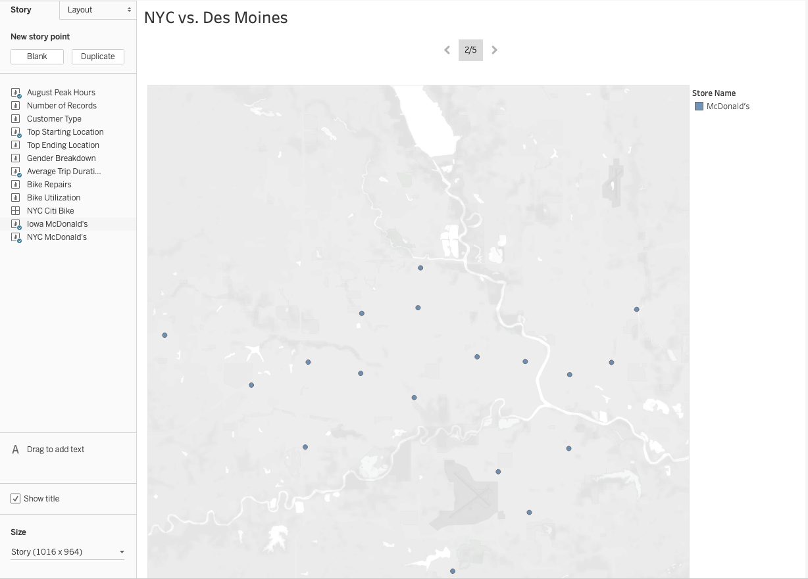

# NYC vs. Des Moines Bike Sharing
After reviewing the datasets provided, I have found a few key points that help
support my theory that bike sharing business model will work in Des Moines. There
are a few areas that I would like to have more data on, but overall, my recommendation
is to start a bike sharing business. Let's dive into my rationale.
### Story Point 1
In my first story point, I look at the top starting location for rides in New York.
We can use the top starting location to get an idea where people are coming from.
In Des Moines, I don't have that data, so I need to find other sources of where
people may be coming from. Let's consider the case of when customers are coming
from McDonald's. McDonald's is a common restaurant in both New York City and in
Des Moines, so it will be a good comparison.

### Story Point 2
My second story point shows all of the McDonald's locations in the metro area
of Des Moines. By seeing all of the McDonald's in Des Moines, we can potentially
relate this to how customers potentially would ride and where they would go. One
area where I would need more data is from where people tend to ride their own
bikes in Des Moines. Would it make sense to have bike sharing stations near the
bike trails so that people wouldn't have to transport their bikes to those trails?
I would need more data to make that determination.

### Story Point 3
My third story point shows all of the McDonald's locations in and around New York
City. The situation is similar with Des Moines, but in this case, it might be
more difficult to argue that McDonald's location has any dictation on where riders
start or end their ride. It's still helpful to know where the majority of the restaurants
are located.

### Story Point 4
In the fourth story point, we consider the primary hours of operation or the bike
sharing program in NYC. More than likely, the bike sharing program would see
different hours in Des Moines simply due to less people and potentially less places
to ride. Since I don't have any data to back this up, the best I can do is
look at other pieces of data and make the best determination. I anticipate that
the primary hours of peak operation will be the same in Des Moines as NYC, just
with less traffic.

### Story Point 5
For the fifth story point, I consider the average trip duration. Since attractions
in Des Moines tend to be more spread out, I anticipate the average trip duration
to go up if we were to start a bike sharing company in Des Moines. This could be
good for business earnings, but more wear and tear on the bikes.

### Summary of Findings
After spending some time looking through the data from New York City and learning
more about the city of Des Moines, I believe it is a good idea to open a bike
sharing company in Des Moines. Given how there are plenty of trails and attractions
are reasonably spread out, it would be a great city to bike in. It will certainly
have to be a different business model, but I believe it will work.
